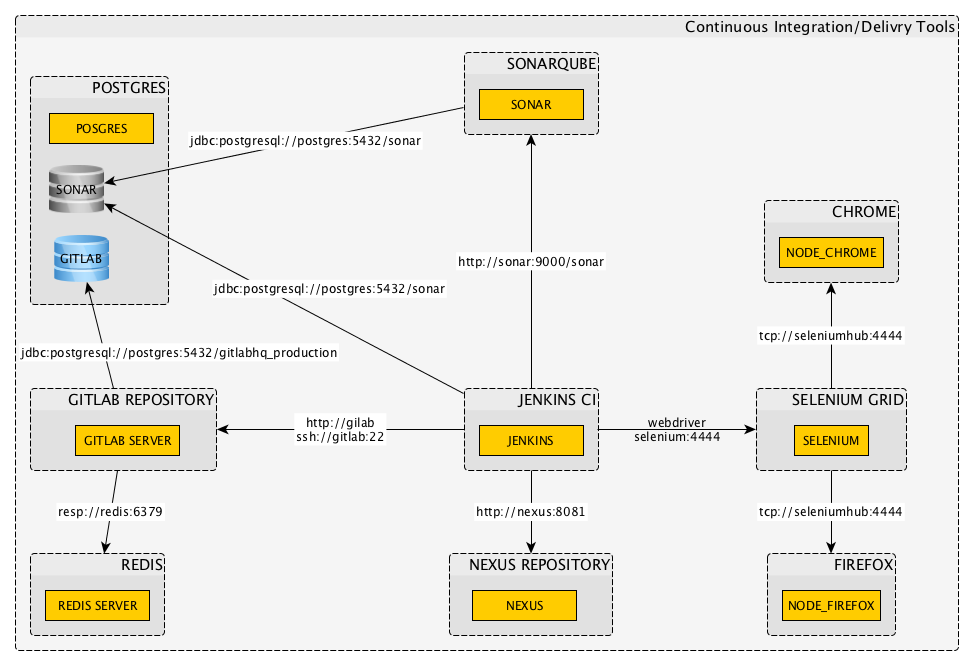

# Continuous Delivery Tools Docker Demo

This GitHub repository contains Docker compose files for running a set of Continuous Delivery Tools with a single command. The diagram contains all tools used in the Docker containers.




# Getting started

To get all docker containers up and running, in __docker__ use:

```
docker-compose up
```

## UPDATE for Linux Users

### Automatically

## Access Tools

#### With docker machine

| *Tool* | *Link* | *Credentials* |
| ------------- | ------------- | ------------- |
| Jenkins | http://${docker-machine ip default}:18080/ | setup login required |
| SonarQube | http://${docker-machine ip default}:19000/ | admin/admin |
| Sonar DB | jdbc:postgresql://${docker-machine ip default}:15432/sonar | cdt_tools/cdt_tools |
| Nexus | http://${docker-machine ip default}:18081/nexus | admin/admin123 |
| GitLab | http://${docker-machine ip default}/ | root/5iveL!fe |
| GitLab DB | jdbc:postgresql://${docker-machine ip default}:15432/gitlabhq_production | cdt_tools/cdt_tools |
| Selenium Grid | http://${docker-machine ip default}:14444/grid/console | no login required |
| Conference App | http://${docker-machine ip default}:48080/currentSessions | no login required |

#### With Docker Ubuntu Native

| *Tool* | *Link* | *Credentials* |
| ------------- | ------------- | ------------- |
| Jenkins | http://localhost:18080/ | setup login required |
| SonarQube | http://localhost:19000/ | admin/admin |
| Sonar DB | jdbc:postgresql://${docker-machine ip default}:5432/sonar | cdt_tools/cdt_tools |
| Nexus | http://localhost:18081/nexus | admin/admin123 |
| GitLab | http://localhost | root/5iveL!fe |
| GitLab DB | jdbc:postgresql://localhost:15432/gitlabhq_production | cdt_tools/cdt_tools |
| Selenium Grid | http://localhost:14444/grid/console | no login required |
| Conference App | http://localhost:48080/currentSessions | no login required |
